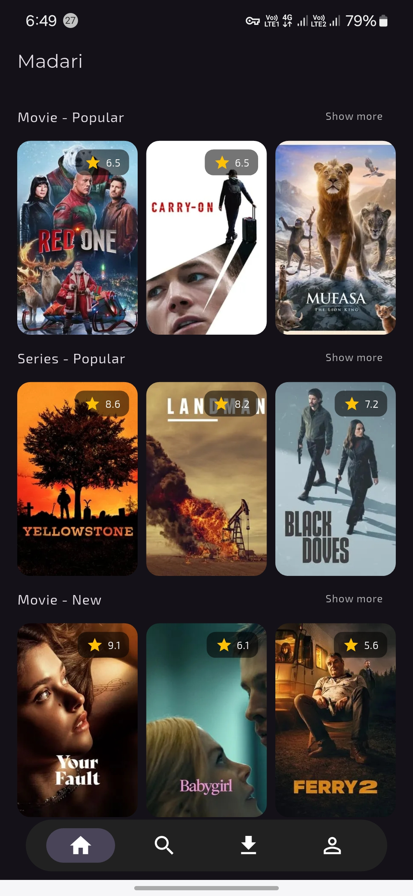

# Open Source Media Manager

An open-source media manager app built with Flutter, designed to stream videos from Stremio addons. This project aims to provide an easy-to-use platform for managing and streaming media content.

## Features
- **Stream Videos** from various Stremio addons.
- **Cross-Platform Support**: Works on Android, iOS supported by Flutter.
- **Open Source**: Contributions are welcome!

## Screenshots



## Getting Started

### Prerequisites
- Dart SDK and Flutter installed on your machine.
- Ensure you have all necessary dependencies for Flutter projects.

### Local Development
To build and run the project locally, use the following command:

```bash
dart run build_runner build --delete-conflicting-outputs
```

### Running the App
1. Clone this repository.
2. Navigate to the project directory.
3. Run the app using Flutter's run command:

```bash
flutter run
```

## Contributing
Contributions, issues, and feature requests are welcome!  
Feel free to fork the repository and submit a pull request.

## Legal Disclaimer

This application is designed to be an open source media player that can process URLs and add-ons.

The developers of Madari:

    Do not host, develop, or distribute any content
    Do not endorse or promote copyright infringement or illegal activities
    Are not responsible for third-party add-ons or content accessed through them
    Expect users to respect intellectual property rights and their local laws

Users are solely responsible for the add-ons they install and content they access through the application.
